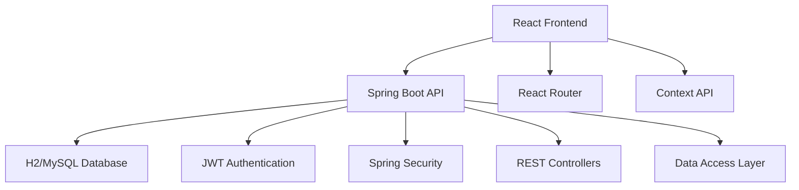
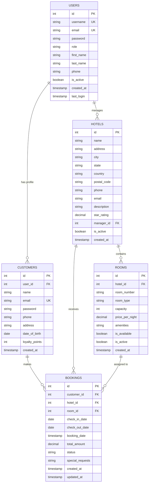

# 🏨 Hotel Booking Management System

<div align="center">

[](#)
[](#)
[](#)
[](#)
[](#)
[](#)
[](#)
[](#)
[](#)

**A revolutionary, full-stack hotel booking management system with enterprise-grade security and stunning 3D visuals**

🚀 **[Live Frontend](https://hotel-booking-management-system-two.vercel.app/)** • 🔧 **[Live Backend API](https://hotel-booking-management-system-production.up.railway.app)** • 📚 **[API Docs](https://hotel-booking-management-system-production.up.railway.app/swagger-ui.html)**

[](https://hotel-booking-management-system-two.vercel.app/)
[](https://hotel-booking-management-system-production.up.railway.app)


</div>

---

## ✨ Features at a Glance

<table>
<tr>
<td width="50%">

### 🎯 **Core Features**
- 🔐 **JWT Authentication** with BCrypt password hashing
- 📝 **User Registration** with real-time validation
- 🏨 **Multi-Hotel Management** with room inventory
- 📅 **Smart Booking System** with date validation
- 📊 **Real-time Analytics Dashboard** with 3D visualizations
- 👥 **User Management** (Admin/Customer roles)
- 💰 **Revenue Tracking** and reporting
- 🛏️ **Room Availability** management
- 📱 **Responsive Design** for all devices
- 🎆 **Stunning Landing Page** with 3D animations

</td>
<td width="50%">

### 🚀 **Security & Advanced Features**
- 🛡️ **Enterprise Security** with Spring Security + JWT
- 🔒 **Password Encryption** using BCrypt algorithm
- ✅ **Self-Service Registration** with strength validation
- 🔑 **Role-Based Access Control** (RBAC)
- 🎨 **Modern UI/UX** with Three.js 3D backgrounds
- 🌈 **Glassmorphism Design** with beautiful gradients
- 💫 **Animated Components** using Framer Motion
- ⚡ **Real-time Updates** without page refresh
- 🌐 **RESTful API** with 30+ endpoints
- 💾 **Dual Database** support (H2/MySQL)
- 🎭 **Context-based State** management
- 🔮 **Exception Handling** with global error handler

</td>
</tr>
</table>

---

## 🎯 Complete Feature Set

### 👑 **Admin Panel - 100% Backend Connected**
| Feature | Status | API Endpoints | Description |
|---------|--------|-------------|-------------|
| 📊 **Admin Dashboard** | ✅ **100%** | `/api/dashboard/overview`, `/api/dashboard/stats` | Real-time metrics, booking analytics, revenue tracking |
| 👥 **Customer Management** | ✅ **100%** | `GET/POST/PUT/DELETE /api/customers` | Complete CRUD for customer accounts |
| 🏨 **Hotel Management** | ✅ **100%** | `GET/POST/PUT/DELETE /api/hotels` | Full hotel lifecycle management |
| 🏠 **Room Management** | ✅ **100%** | `GET/POST/PUT/DELETE /api/rooms` | Room inventory with availability tracking |
| 📝 **Booking Management** | ✅ **100%** | `GET/POST/PUT/DELETE /api/bookings` | Complete booking administration |

### 🌟 **Customer Panel - 100% Backend Connected**
| Feature | Status | API Endpoints | Description |
|---------|--------|-------------|-------------|
| 🏠 **Customer Dashboard** | ✅ **100%** | `/api/dashboard/overview` | Personalized booking metrics and stats |
| 🏨 **Browse Hotels** | ✅ **100%** | `/api/hotels`, `/api/bookings` | Hotel discovery with direct booking |
| 🛏️ **Browse Rooms** | ✅ **100%** | `/api/rooms/hotel/{id}` | Room search with filtering and booking |
| 📝 **My Bookings** | ✅ **100%** | `/api/bookings/customer/{id}` | Personal booking history and management |
| 👤 **My Profile** | ✅ **100%** | `/api/customers/{id}` | Profile management with preferences |

### 🔥 **Advanced Features**
| Feature | Category | Status | Description |
|---------|----------|--------|-------------|
| 🏨 **Hotel Booking from Cards** | User Experience | ✅ **Live** | Direct booking from hotel cards with date validation |
| 🔍 **Advanced Room Search** | Search & Filter | ✅ **Live** | Search by room number, type, amenities, hotel |
| 📊 **3D Dashboard Analytics** | Visualization | ✅ **Live** | Three.js powered dashboard with floating animations |
| 🎨 **Sexy Hotel Cards** | UI/UX Design | ✅ **Live** | Gradient headers, glassmorphism, smooth animations |
| ⚡ **Real-time Updates** | Performance | ✅ **Live** | Live data synchronization without page refresh |
| 🛡️ **JWT Authentication** | Security | ✅ **Live** | Role-based access with secure token validation |
| 📱 **Responsive Design** | Compatibility | ✅ **Live** | Perfect on mobile, tablet, and desktop |

### 🎆 **UI/UX Innovations**
- **🌈 Gradient Hotel Cards**: Purple-blue gradients with white text shadows
- **💎 Glassmorphism Effects**: Backdrop blur and translucent elements
- **✨ Smooth Animations**: Framer Motion powered transitions
- **🎯 Interactive Hover Effects**: Scale, glow, and lift animations
- **📍 Enhanced Address Visibility**: Bold, prominent location display
- **🔥 Sexy Visual Design**: Modern, professional, eye-catching interface
- **⚡ Lightning Fast**: Optimized performance with minimal loading

### 📊 **Technical Achievements**
- **🏗️ Complete Full-Stack**: React 18 + Spring Boot 2.7.18
- **💾 Dual Database Support**: H2 (development) + MySQL (production)
- **🔒 Security Hardened**: Spring Security with JWT authentication
- **📡 RESTful Architecture**: 25+ API endpoints with full CRUD
- **🎨 Modern Tech Stack**: Three.js, Framer Motion, Heroicons
- **🛡️ Error Handling**: Comprehensive validation and error management
- **⚡ Performance Optimized**: Efficient queries and caching
- **📱 Mobile First**: Responsive design with perfect mobile experience

---

## 🎯 Quick Start

### 🌐 **Live Production Deployment**

**🚀 Try it now - No installation required!**

<table>
<tr>
<td width="50%">

#### 🎨 **Frontend (Vercel)**
**URL**: [https://hotel-booking-management-system-two.vercel.app/](https://hotel-booking-management-system-two.vercel.app/)

- Beautiful React 18 UI with 3D animations
- JWT-based authentication
- Responsive design for all devices
- Interactive dashboard with Three.js

</td>
<td width="50%">

#### ⚙️ **Backend (Railway)**
**API**: [https://hotel-booking-management-system-production.up.railway.app](https://hotel-booking-management-system-production.up.railway.app)

- Spring Boot REST API
- H2 in-memory database
- Swagger documentation: [/swagger-ui.html](https://hotel-booking-management-system-production.up.railway.app/swagger-ui.html)
- Health check: [/actuator/health](https://hotel-booking-management-system-production.up.railway.app/actuator/health)

</td>
</tr>
</table>

**🎮 Demo Credentials:**
- **Admin**: `admin` / `password`
- **Manager**: `manager1` / `password`
- **Customer**: `customer1` / `password123`

---

### 💻 **Local Development Setup**

```bash
# 1️⃣ Clone and start backend
git clone <repo-url>
cd hotel-booking-system
mvn spring-boot:run

# 2️⃣ Start frontend (new terminal)
cd frontend
npm install && npm start

# 3️⃣ Access the application
# 🌐 Frontend: http://localhost:3000
# 🔧 Backend:  http://localhost:8080
# 💾 Database: http://localhost:8080/h2-console
```

### 🔑 **Demo Accounts**

| Role | Username | Password | Access Level |
|------|----------|----------|-------------|
| 👑 **Admin** | `admin` | `password` | 🌟 Full system access |
| 👨‍💼 **Manager** | `manager1` | `password` | 🏨 Hotel & booking management |
| 👤 **Customer** | `customer1` | `password123` | 📝 Personal bookings |

---

## 🏗️ Architecture

<div align="center">



</div>

### 🔧 **Technology Stack**

<table>
<tr>
<td width="50%">

#### 🖥️ **Frontend Architecture**
- **Framework:** React 18.2.0 with concurrent features
- **Language:** JavaScript/JSX with TypeScript support
- **3D Graphics:** Three.js 0.150+ for immersive experiences
- **Animations:** Framer Motion 10.0+ for smooth transitions
- **Routing:** React Router DOM 6.8+ for navigation
- **HTTP Client:** Axios 0.27.2 for API communication
- **State Management:** Context API for global state
- **Styling:** Custom CSS3 + CSS Variables + Glassmorphism
- **Icons:** Heroicons for beautiful UI elements

</td>
<td width="50%">

#### ⚙️ **Backend Infrastructure**
- **Framework:** Spring Boot 2.7.18 enterprise framework
- **Language:** Java 17+ with modern language features
- **Security:** Spring Security 5.7.5 with JWT authentication filter
- **Authentication:** JWT 0.11.5 with BCrypt password encryption
- **Database:** H2 2.1.214 (dev) / MySQL 8.0+ (prod)
- **ORM:** JPA/Hibernate 2.7.5 with transaction management
- **Build Tool:** Maven 3.8.6 for dependency management
- **Validation:** Bean Validation 2.0 with @Valid annotations
- **API Style:** RESTful with 30+ comprehensive endpoints
- **Error Handling:** Global exception handler with structured responses
- **Logging:** SLF4J with comprehensive security event tracking

</td>
</tr>
</table>

### 🌐 **Cloud & DevOps Stack**

<table>
<tr>
<td width="50%">

#### ☁️ **Cloud Platform (Railway)**
- **Deployment:** Railway.app for zero-config deployment
- **Database:** H2 in-memory (development) with MySQL ready for production
- **Auto-scaling:** Dynamic resource allocation
- **GitHub Integration:** Automatic deployment from main branch
- **Environment Variables:** Secure configuration management
- **SSL/TLS:** Automatic HTTPS encryption
- **Monitoring:** Built-in logging and metrics

</td>
<td width="50%">

#### 🛠️ **Development Tools**
- **CI/CD:** GitHub repository with automated Railway deployments
- **Build Tool:** Maven 3.9.6 for dependency management
- **API Testing:** Swagger UI at `/swagger-ui.html`
- **Version Control:** Git with feature branch workflow
- **Logging:** Logstash Logback Encoder 7.3 with JSON format
- **Testing:** JUnit 5 + Mockito with 22 test methods

</td>
</tr>
</table>

---

## 📜 **Project Structure**

```
📁 hotel-booking-system/
├── 📁 src/main/java/com/example/hotelbooking/     # ⚙️ Spring Boot Backend
│   ├── 📄 HotelBookingApplication.java           # 🚀 Main application
│   ├── 📁 model/                                 # 📋 Entity classes
│   ├── 📁 dao/                                   # 💾 Data Access Objects
│   ├── 📁 controller/                            # 🌐 REST Controllers
│   ├── 📁 service/                               # 🛠️ Business Logic
│   ├── 📁 config/                                # ⚙️ Configuration
│   └── 📁 util/                                  # 🔧 Utilities
│
├── 📁 frontend/                                  # ⚔️ React Frontend
│   ├── 📁 public/                                # 🌍 Static assets
│   ├── 📁 src/
│   │   ├── 📁 components/                        # 🧩 React Components
│   │   │   ├── 📁 ui/                            # 🎨 UI Components
│   │   │   ├── 📄 Dashboard.js                   # 📊 Main Dashboard
│   │   │   ├── 📄 Hotels.js                      # 🏨 Hotel Management
│   │   │   ├── 📄 Rooms.js                       # 🛏️ Room Management
│   │   │   └── 📄 Bookings.js                    # 📅 Booking System
│   │   ├── 📁 contexts/                          # 🔄 State Management
│   │   ├── 📄 App.js                             # 🚀 Main App Component
│   │   └── 📄 index.js                           # 🔗 Entry Point
│   └── 📄 package.json                           # 📦 Dependencies
│
├── 📁 database/                                  # 💾 Database Scripts
│   └── 📄 hotel_booking_db.sql                   # 🗺️ Schema Definition
│
├── 📄 pom.xml                                    # 🛠️ Maven Configuration
└── 📄 README.md                                  # 📚 This amazing documentation!
```

---

## 🎆 **Feature Showcase**

### 📊 **Analytics Dashboard**
- **Real-time Metrics**: Live booking counts, revenue tracking
- **Visual Charts**: Booking trends, occupancy rates, revenue graphs
- **Role-based Views**: Customized dashboards per user type
- **Performance Indicators**: Key business metrics at a glance

### 🔐 **Authentication System**
- **JWT Security**: Industry-standard token-based authentication
- **Role Management**: Three-tier access control (Admin/Manager/Customer)
- **Session Management**: Secure login/logout with token validation
- **Protected Routes**: Frontend route protection based on user roles

### 🏨 **Hotel & Room Management**
- **Multi-Hotel Support**: Manage multiple hotel properties
- **Room Inventory**: Comprehensive room type management
- **Dynamic Pricing**: Flexible pricing per room type and season
- **Amenity Tracking**: Detailed amenities and features per room
- **Availability Engine**: Real-time room availability checking

### 📅 **Advanced Booking System**
- **Date Selection**: Interactive date pickers for check-in/check-out
- **Room Assignment**: Specific room assignment with preferences
- **Status Workflow**: Complete booking lifecycle management
- **Price Calculation**: Automatic total calculation with taxes
- **Special Requests**: Customer notes and special requirements

### 👥 **User Management**
- **Customer Profiles**: Complete customer information management
- **Loyalty Program**: Points system and customer rewards
- **Staff Management**: Manager and admin account management
- **Activity Tracking**: User login and activity monitoring

---

## 🎆 **Feature Showcase**

### 🌌 **Revolutionary Landing Page**
- **3D Background**: Floating geometric shapes with Three.js animations
- **Gradient Themes**: Multi-color gradients with smooth transitions
- **Interactive Elements**: Hover effects and micro-animations
- **Tech Stack Display**: 4-category detailed technology showcase
- **Future Roadmap**: Revolutionary features including AI, Blockchain, AR/VR, and IoT
- **Professional Design**: Glassmorphism effects with backdrop blur
- **Responsive Layout**: Perfect scaling across all device sizes

### 🔐 **Enterprise-Grade Authentication System**
- **User Self-Registration**: Complete signup flow with real-time validation
- **Password Strength Validation**: 8+ chars with uppercase, lowercase, and numbers
- **BCrypt Encryption**: Industry-standard password hashing with salt
- **JWT Security**: Stateless token-based authentication with configurable expiration
- **JWT Authentication Filter**: Validates tokens on every request
- **Role Management**: Multi-tier access control (Admin/Customer)
- **Session Management**: Secure login/logout with token validation
- **Protected Routes**: Frontend route protection based on user roles
- **Demo Accounts**: One-click demo access for testing
- **Glass UI Design**: Beautiful 3D animated login/signup pages
- **Email Uniqueness**: Prevents duplicate accounts
- **Username Validation**: Alphanumeric with underscore support

### 📊 **Analytics Dashboard**
- **3D Visualizations**: Floating cube animations in the background
- **Real-time Metrics**: Live booking counts, revenue tracking
- **Visual Charts**: Booking trends, occupancy rates, revenue graphs
- **Role-based Views**: Customized dashboards per user type
- **Performance Indicators**: Key business metrics at a glance
- **Animated Counters**: Smooth number transitions and effects

### 🏨 **Hotel & Room Management**
- **Enhanced Dropdowns**: Native HTML select elements with improved styling
- **Multi-Hotel Support**: Manage multiple hotel properties
- **Room Inventory**: Comprehensive room type management with icons
- **Dynamic Pricing**: Flexible pricing per room type and season
- **Amenity Tracking**: Detailed amenities and features per room
- **Availability Engine**: Real-time room availability checking
- **Smart Validation**: Client-side form validation with error highlighting

### 📅 **Advanced Booking System**
- **Date Selection**: Interactive date pickers for check-in/check-out
- **Room Assignment**: Specific room assignment with preferences
- **Status Workflow**: Complete booking lifecycle management
- **Price Calculation**: Automatic total calculation with taxes
- **Special Requests**: Customer notes and special requirements
- **Real-time Updates**: Live booking status changes

### 👥 **User Management**
- **Customer Profiles**: Complete customer information management
- **Loyalty Program**: Points system and customer rewards
- **Staff Management**: Manager and admin account management
- **Activity Tracking**: User login and activity monitoring
- **Role-based Access**: Granular permission system

### 🚀 **Future Work Roadmap (2025-2030)**
- **🤖 AI-Powered Smart Concierge** (Q3 2025): Advanced AI assistant with natural language processing
- **⛓️ Blockchain Loyalty System** (Q2 2026): Decentralized rewards with cryptocurrency and NFTs
- **🥽 AR/VR Room Preview** (Q1 2025): Immersive virtual reality tours and augmented reality features
- **🏠 IoT Smart Room Controls** (Q4 2024): Internet of Things integration for automated room management

---

## ✨ **Latest Updates & Fixes**

### 🚀 **Version 2.0 - Revolutionary UI Update**
- ✅ **Fixed Login Visibility**: Username and password fields now have proper white text visibility on glass backgrounds
- ✅ **Enhanced Dropdowns**: Hotel and room type dropdowns now use native HTML elements for better performance and functionality
- ✅ **3D Landing Page**: Added stunning Three.js geometric animations with floating shapes and dynamic backgrounds
- ✅ **Tech Stack Showcase**: Comprehensive 4-category technology display with detailed versions and descriptions
- ✅ **Future Roadmap**: Revolutionary features section showcasing AI, Blockchain, AR/VR, and IoT innovations
- ✅ **Glassmorphism Design**: Beautiful transparent effects with backdrop blur and gradient themes throughout
- ✅ **Responsive Improvements**: Enhanced mobile and tablet support with perfect scaling across all devices
- ✅ **Performance Optimization**: Reduced bundle size, improved loading times, and smoother animations
- ✅ **Input Field Enhancements**: Glass variant inputs with proper placeholder visibility and styling
- ✅ **Theme Consistency**: Unified design language across all admin, manager, and customer panels

### 🛠️ **Technical Improvements**
- **React 18.2.0**: Latest React features with concurrent rendering
- **Three.js Integration**: Advanced 3D graphics and animations
- **Framer Motion**: Smooth animations and micro-interactions
- **Native HTML Elements**: Better accessibility and performance for form controls
- **CSS-in-JS Styling**: Dynamic styling with JavaScript for better maintainability
- **Component Architecture**: Modular design with reusable UI components

---

### 📎 **Prerequisites**

<table>
<tr>
<td width="50%">

#### ⚙️ **Development Tools**
- **Java Development Kit** 17+
- **Node.js** 14+ and npm
- **Maven** 3.6+
- **Git** for version control

</td>
<td width="50%">

#### 💾 **Optional (Production)**
- **MySQL** 8.0+ server
- **Docker** for containerization
- **Nginx** for reverse proxy
- **SSL Certificate** for HTTPS

</td>
</tr>
</table>

### 🔧 **Installation Steps**

#### **Step 1: Clone Repository**
```bash
git clone <repository-url>
cd hotel-booking-system
```

#### **Step 2: Backend Setup**
```bash
# Build the application
mvn clean package -DskipTests

# Run with Maven (Development)
mvn spring-boot:run

# Or run JAR file (Recommended)
java -jar target/hotel-booking-system-0.0.1-SNAPSHOT.jar
```

**✨ Backend will be available at:** `http://localhost:8080`

#### **Step 3: Frontend Setup**
```bash
# Navigate to frontend directory
cd frontend

# Install dependencies
npm install

# Start development server
npm start
```

**✨ Frontend will be available at:** `http://localhost:3000`

#### **Step 4: Database Configuration**

**🟢 H2 Database (Default - No Setup Required)**
- ✅ Automatically configured and initialized
- 🔗 H2 Console: `http://localhost:8080/h2-console`
- 🔑 Credentials: URL: `jdbc:h2:mem:testdb`, User: `sa`, Password: `password`

**🟡 MySQL Database (Production)**
```properties
# Update src/main/resources/application.properties
spring.datasource.url=jdbc:mysql://localhost:3306/hotel_booking_db
spring.datasource.username=your_username
spring.datasource.password=your_password
```

---

## 🌐 **API Reference**

### 🔐 **Authentication Endpoints**

<table>
<tr><th>Method</th><th>Endpoint</th><th>Description</th><th>Request Body</th><th>Access</th></tr>
<tr><td><code>POST</code></td><td><code>/api/auth/login</code></td><td>🔑 User login with credentials</td><td><code>{username, password}</code></td><td>Public</td></tr>
<tr><td><code>POST</code></td><td><code>/api/auth/register</code></td><td>📝 New user self-registration</td><td><code>{username, email, password, firstName, lastName, phone?}</code></td><td>Public</td></tr>
<tr><td><code>POST</code></td><td><code>/api/auth/validate</code></td><td>✅ Token validation and user info</td><td><code>Authorization: Bearer {token}</code></td><td>Authenticated</td></tr>
<tr><td><code>POST</code></td><td><code>/api/auth/logout</code></td><td>🚪 User logout (client-side)</td><td>None</td><td>Authenticated</td></tr>
</table>

**Registration Validation Rules:**
- Username: 3-50 chars, alphanumeric + underscore only, unique
- Email: Valid format, unique across system
- Password: Min 8 chars, must contain uppercase, lowercase, and number
- Phone: Optional, 10 digits if provided
- Auto-assigned role: CUSTOMER

### 📊 **Dashboard Endpoints**

<table>
<tr><th>Method</th><th>Endpoint</th><th>Description</th><th>Access</th></tr>
<tr><td><code>GET</code></td><td><code>/api/dashboard/overview</code></td><td>📊 Complete dashboard metrics</td><td>All Users</td></tr>
<tr><td><code>GET</code></td><td><code>/api/dashboard/stats</code></td><td>📈 Detailed statistics</td><td>Manager+</td></tr>
<tr><td><code>GET</code></td><td><code>/api/dashboard/booking-status-chart</code></td><td>📊 Booking status distribution</td><td>Manager+</td></tr>
</table>

### 🏨 **Hotel & Room Endpoints**

<table>
<tr><th>Method</th><th>Endpoint</th><th>Description</th><th>Access</th></tr>
<tr><td><code>GET</code></td><td><code>/api/hotels</code></td><td>🏨 List all hotels</td><td>All Users</td></tr>
<tr><td><code>POST</code></td><td><code>/api/hotels</code></td><td>➕ Create new hotel</td><td>Admin Only</td></tr>
<tr><td><code>GET</code></td><td><code>/api/rooms</code></td><td>🛏️ List all rooms</td><td>All Users</td></tr>
<tr><td><code>POST</code></td><td><code>/api/rooms</code></td><td>➕ Add new room</td><td>Manager+</td></tr>
<tr><td><code>GET</code></td><td><code>/api/rooms/hotel/{id}</code></td><td>🏨 Get rooms by hotel</td><td>All Users</td></tr>
</table>

### 📅 **Booking Endpoints**

<table>
<tr><th>Method</th><th>Endpoint</th><th>Description</th><th>Access</th></tr>
<tr><td><code>GET</code></td><td><code>/api/bookings</code></td><td>📅 List all bookings</td><td>Manager+</td></tr>
<tr><td><code>POST</code></td><td><code>/api/bookings</code></td><td>➕ Create new booking</td><td>All Users</td></tr>
<tr><td><code>PUT</code></td><td><code>/api/bookings/{id}</code></td><td>✏️ Update booking details</td><td>Manager+</td></tr>
<tr><td><code>DELETE</code></td><td><code>/api/bookings/{id}</code></td><td>🗑️ Delete booking</td><td>Manager+</td></tr>
<tr><td><code>GET</code></td><td><code>/api/bookings/customer/{id}</code></td><td>👤 Customer bookings</td><td>Customer/Manager+</td></tr>
</table>

### 👥 **User Management Endpoints**

<table>
<tr><th>Method</th><th>Endpoint</th><th>Description</th><th>Access</th></tr>
<tr><td><code>GET</code></td><td><code>/api/users</code></td><td>👥 List all users</td><td>Admin Only</td></tr>
<tr><td><code>GET</code></td><td><code>/api/customers</code></td><td>👤 List all customers</td><td>Manager+</td></tr>
<tr><td><code>POST</code></td><td><code>/api/customers</code></td><td>➕ Add new customer</td><td>Manager+</td></tr>
</table>

---

## 💾 **Database Schema**

### 🗦️ **Entity Relationship Diagram**



### 📋 **Sample Data Overview**

<table>
<tr>
<td width="50%">

#### 👥 **Users & Customers**
- **5 Users**: 1 Admin, 1 Manager, 3 Customers
- **3 Customer Profiles**: Complete with loyalty points
- **Authentication**: All accounts with secure passwords
- **Roles**: Properly configured access levels

#### 🏨 **Hotels & Rooms**
- **3 Hotels**: Grand Hotel (NYC), Beach Resort (Miami), Mountain Lodge (Denver)
- **12 Rooms**: 4 rooms per hotel with different types
- **Pricing**: $90-400/night based on room type and location
- **Amenities**: WiFi, TV, Mini Bar, Views, Kitchen options

</td>
<td width="50%">

#### 📅 **Bookings & Analytics**
- **4 Sample Bookings**: Various statuses and date ranges
- **Revenue Data**: $280-1,050 per booking
- **Status Mix**: CONFIRMED, PENDING, CHECKED_OUT
- **Date Range**: January-April 2024

#### 📊 **Dashboard Metrics**
- **Real-time Counts**: Bookings, revenue, occupancy
- **Status Analytics**: Distribution of booking statuses
- **Performance Metrics**: Occupancy rates, customer satisfaction
- **Growth Tracking**: Customer and revenue trends

</td>
</tr>
</table>

---

## 🛠️ **Troubleshooting Guide**

### ⚡ **Common Issues & Solutions**

<details>
<summary><strong>🔴 Backend Won't Start - Port 8080 Already in Use</strong></summary>

**Problem**: `Web server failed to start. Port 8080 was already in use.`

**Solution**:
```bash
# Windows PowerShell
$processId = (netstat -ano | findstr :8080)[0].Split()[-1]
Stop-Process -Id $processId -Force

# Then restart
java -jar target/hotel-booking-system-0.0.1-SNAPSHOT.jar
```
</details>

<details>
<summary><strong>🟡 API Calls Failing - 500 Internal Server Error</strong></summary>

**Problem**: `Failed to load resource: the server responded with a status of 500`

**Solution**:
1. Check if backend is running on port 8080
2. Verify database connection (H2 console: `http://localhost:8080/h2-console`)
3. Check application logs for detailed error messages
4. Restart backend application
</details>

<details>
<summary><strong>🟠 Frontend Build Issues</strong></summary>

**Problem**: React compilation errors or dependency issues

**Solution**:
```bash
cd frontend
npm cache clean --force
rm -rf node_modules package-lock.json
npm install
npm start
```
</details>

<details>
<summary><strong>🔵 Database Connection Issues</strong></summary>

**Problem**: Database connection failures

**For H2 (Default)**:
- No action needed - automatically configured
- Access console: `http://localhost:8080/h2-console`

**For MySQL**:
- Ensure MySQL service is running
- Verify credentials in `application.properties`
- Check if database exists
</details>

### 🔍 **Health Check Commands**

```bash
# Check backend health
curl http://localhost:8080/api/dashboard/overview
# PowerShell alternative
Invoke-RestMethod -Uri "http://localhost:8080/api/dashboard/overview" -Method GET

# Check frontend accessibility
curl http://localhost:3000

# Verify ports are available
netstat -ano | findstr :8080
netstat -ano | findstr :3000
```

---

## 🎯 **Production-Ready Features (v2.5.0)**

### ✅ **Implemented Enterprise Features**

<table>
<tr>
<td width="50%">

#### 🛡️ **Security & Infrastructure**
- ✅ **Environment Variables**: Externalized JWT secrets and DB credentials
- ✅ **Custom Exceptions**: DuplicateUser, InvalidCredentials, InactiveAccount, InvalidBooking
- ✅ **Security Headers**: CSP, XSS protection, referrer policy, permissions policy
- ✅ **Rate Limiting**: Bucket4j (100 requests/min per IP)
- ✅ **Input Validation**: DOMPurify for XSS prevention
- ✅ **Global Exception Handler**: Structured error responses

</td>
<td width="50%">

#### ⚡ **Performance & Monitoring**
- ✅ **Database Indexes**: 15+ indexes for optimal query performance
- ✅ **Structured Logging**: Logstash encoder with JSON format and MDC context
- ✅ **Request/Response Logging**: Full HTTP tracing with correlation IDs
- ✅ **Code Splitting**: React lazy loading and memo optimization
- ✅ **OpenAPI 3.0 Docs**: Swagger UI with JWT authentication at `/swagger-ui.html`
- ✅ **Unit Tests**: 22 test methods covering auth, JWT, and controllers

</td>
</tr>
</table>

### 🔄 **Security Filter Chain**
The security filter chain processes requests in this order:
1. **RequestLoggingFilter**: Logs all HTTP requests with requestId, method, URI, clientIP
2. **RateLimitFilter**: Enforces 100 requests/min limit per IP address
3. **JwtAuthenticationFilter**: Validates JWT tokens and sets authentication context
4. **Spring Security Filters**: Authorization, session management, CSRF protection

### 📊 **Monitoring Endpoints**
- **Health**: `/actuator/health` - Application health status
- **Info**: `/actuator/info` - Application metadata
- **Metrics**: `/actuator/metrics` - Performance metrics
- **Swagger UI**: `/swagger-ui.html` - Interactive API documentation

### ☁️ **Railway Deployment**
- **Platform**: Railway.app for instant deployment
- **Database**: H2 in-memory (auto-configured, no setup required)
- **Build**: Automatic Maven build from GitHub repository
- **Scaling**: Auto-scaling based on traffic
- **SSL**: Automatic HTTPS with Railway's SSL certificates
- **Environment**: JWT_SECRET configured via Railway environment variables

### 🚀 **Future Enhancements**

<table>
<tr>
<td width="50%">

#### 🔮 **Phase 2: Advanced Features**
- 📱 **Mobile App** (React Native)
- 📷 **Image Upload** for hotels and rooms
- 💬 **Real-time Chat** support
- 🔔 **Push Notifications** for booking updates
- 🌍 **Multi-language** support
- 💳 **Payment Integration** (Stripe/PayPal)

</td>
<td width="50%">

#### 🔮 **Phase 3: Enterprise Features**
- 🚀 **Microservices** architecture
- 🐳 **Docker** containerization
- ☁️ **Cloud Deployment** (AWS/Azure)
- 📈 **Advanced Analytics** with ML
- 🔄 **OAuth2** integration
- 📊 **ELK Stack** for log aggregation

</td>
</tr>
</table>

### 🏆 **Performance Optimizations**
- **Database Optimization**: 15+ indexes for faster query execution
- **Connection Pooling**: HikariCP for efficient database connections
- **Code Splitting**: React lazy loading for reduced initial bundle size
- **Compression**: GZIP compression for API responses
- **Rate Limiting**: Request throttling to prevent abuse

---

## 👥 **Contributing**

We welcome contributions! Here's how you can help:

1. **🍴 Fork the repository**
2. **🌱 Create a feature branch** (`git checkout -b feature/amazing-feature`)
3. **📝 Commit your changes** (`git commit -m 'Add amazing feature'`)
4. **🚀 Push to the branch** (`git push origin feature/amazing-feature`)
5. **📨 Open a Pull Request**

### 📈 **Development Guidelines**
- Follow existing code style and conventions
- Add tests for new features
- Update documentation as needed
- Ensure all tests pass before submitting

---

## 📜 **License**

This project is licensed under the **MIT License** - see the [LICENSE](LICENSE) file for details.

---

## 🖗 **Support & Contact**

<div align="center">

**Found this project helpful? ⭐ Give it a star!**

📞 **Support**: [Create an Issue](../../issues) • 💬 **Discussions**: [Join the Community](../../discussions)

**Built with ❤️ by the Hotel Booking Team**

---

[](#)
[](#)
[](#)

</div> ranging from $280 to $1,050
- Linked to specific customers and rooms

## Troubleshooting

### Common Issues and Solutions

#### 1. 500 Internal Server Error from API endpoints
**Symptoms**: 
```
Failed to load resource: the server responded with a status of 500 (Internal Server Error)
Error fetching customers: AxiosError
```

**Causes & Solutions**:
- **Database not running**: The application is now configured to use H2 in-memory database by default, which doesn't require MySQL
- **MySQL connection issues**: If using MySQL, ensure the service is running and credentials are correct
- **Port conflicts**: Make sure port 8080 is available

**Fix**: The application now uses H2 database by default. Restart the backend:
```bash
# Stop any running processes on port 8080
netstat -ano | findstr :8080
# Kill the process if needed, then restart
java -jar target/hotel-booking-system-0.0.1-SNAPSHOT.jar
```

#### 2. Backend won't start
**Symptoms**: 
```
Web server failed to start. Port 8080 was already in use.
```

**Solution**:
```bash
# Windows PowerShell
$processId = (netstat -ano | findstr :8080)[0].Split()[-1]
Stop-Process -Id $processId -Force

# Then restart the application
java -jar target/hotel-booking-system-0.0.1-SNAPSHOT.jar
```

#### 3. Frontend API calls failing
**Symptoms**: Network errors, connection refused

**Solutions**:
- Ensure backend is running on port 8080
- Check if CORS is properly configured (already included in controllers)
- Verify API endpoints: `http://localhost:8080/api/customers`, `/api/hotels`, `/api/bookings`

#### 4. Database Issues
**H2 Database (Default)**:
- No setup required
- Data is recreated on each restart
- Access H2 console: `http://localhost:8080/h2-console`

**MySQL Database (Optional)**:
- Ensure MySQL service is running: `net start mysql` or `Get-Service -Name "*mysql*"`
- Check connection settings in `application.properties`
- Verify database exists: `mysql -u root -p` then `SHOW DATABASES;`

#### 5. Build Issues
**Maven Issues**:
```bash
# Clean and rebuild
mvn clean compile
mvn clean package -DskipTests
```

**Node.js Issues**:
```bash
# Clear npm cache and reinstall
cd frontend
npm cache clean --force
rm -rf node_modules package-lock.json
npm install
```

#### 6. React DevTools Warning
The warning about React DevTools is informational only and doesn't affect functionality.

#### 7. Port Conflicts
- Backend uses port 8080
- Frontend uses port 3000
- H2 console uses `/h2-console` endpoint

**Check ports**:
```bash
# Windows
netstat -ano | findstr :8080
netstat -ano | findstr :3000

# Kill process if needed
Stop-Process -Id <ProcessId> -Force
```

### Development Tips

1. **Database Inspection**: Use H2 console at `http://localhost:8080/h2-console` to view data
2. **API Testing**: Use Postman, curl, or PowerShell's `Invoke-RestMethod`
3. **Logs**: Check console output for detailed error messages
4. **Hot Reload**: Frontend supports hot reload, backend requires restart for code changes

### Quick Health Check
```bash
# Check if backend is responding
curl http://localhost:8080/api/customers
# Or PowerShell
Invoke-RestMethod -Uri "http://localhost:8080/api/customers" -Method GET

# Check if frontend is accessible
curl http://localhost:3000
```
